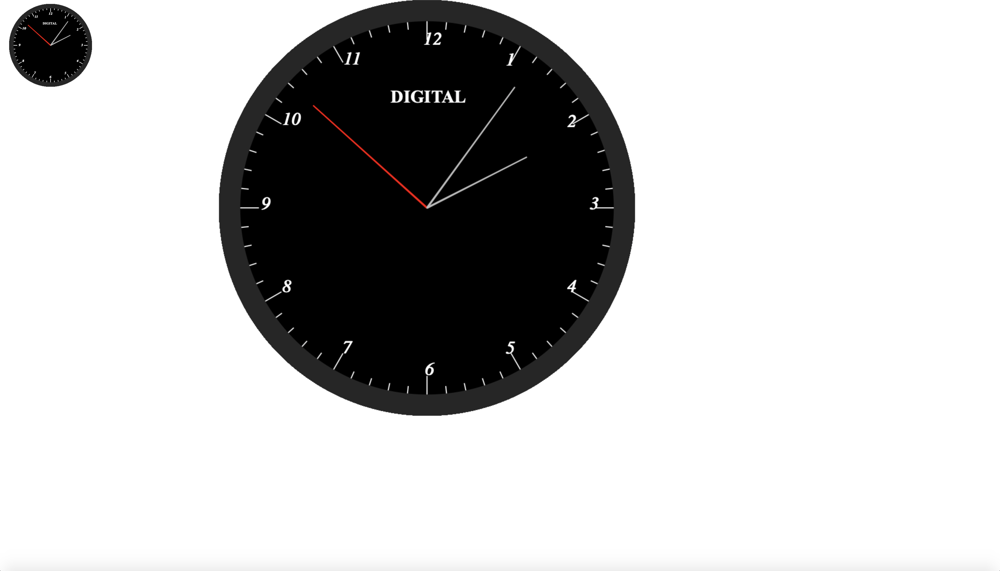

# clock-js
A simple vanilla(pure) Javascript library for adding wall clocks to your web application

**clock-js** allows you to add a wall-clock to your we application with ease.

### Background
**clock-js** is the javascript translation of [simple-desk-clock](https://github.com/gbenroscience/simple-desk-clock) a Java application by the same author.

**clock-js** will make it trivial for web-devs to add clock functionality to web and Javascript apps.

Here is an image of what the clock looks like:

### Usage

To add clock functionality to your webpage, **clock-js** needs a canvas element placed in the right place in the DOM(HTML code). For instance,

  `<canvas id="clock-1" style="float: left; margin-left: 10px; width: 10em; height: 10em;"></canvas>`

Next, create a clock-js object:

    var clock = new Clock({
                    canvasId: 'clock-1',
                    outerColor: 'transparent',
                    middleColor: '#262626',
                    innerColor: '#000',
                    centerSpotWidth: 2,
                    outerCircleAsFractionOfFrameSize: 1.0,
                    showBaseText: false
                });
                clock.run();

To stop this clock instance, do: 
`clock.kill();`  

As an example, we can do:

    var clock = new Clock({
                    canvasId: 'clock-1',
                    outerColor: 'transparent',
                    middleColor: '#262626',
                    innerColor: '#000',
                    centerSpotWidth: 2,
                    outerCircleAsFractionOfFrameSize: 1.0,
                    showBaseText: false
                });
                clock.run();

         setTimeout(function() {
                    clock.kill();
                }, 10000);
                
                
                
This will create a clock instance that renders on the canvas in the DOM whose `id` is **clock-1**

**`clock.run()`** starts the clock animation that runs the clock. 

The clock will run for 10 seconds and then stop running, due to the **`setTimeout`** block.

This is how easy it is to deploy the clock

If you want a clock that floats on your page, specify the `floating` field in your clock's options, and set it to true. In this case, yo need not add the canvas element to your code. The clock will dynamically create a canvas object and inject it in your HTML code.

You may customize the dynamically created object by specifying the canvas entry:

         var clock = new Clock({
                    canvasId: 'clock-2',
                    floating: true,
                    outerColor: 'transparent',
                    middleColor: '#262626',
                    innerColor: '#000',
                    centerSpotWidth: 2,
                    outerCircleAsFractionOfFrameSize: 1.0,
                    showBaseText: false,
                    canvas: {
                        x: 100,
                        y: 100,
                        width: 800,
                        height:800
                    }
                });
                clock2.run();

The 4 most important fields which it takes are: the `x , y, width and height` parameters.

### Fields of the canvas:

`x` is the distance of the clock's left side from the left of the webpage

`y` is the distance of the clock's top from the top of the webpage

`width` is the pixel width of the canvas

`height` is the pixel height of the canvas

If  you do not add the `floating` field at all or you set it to false, then you have to specify the canvas tag in your code, so that the clock will know what canvas to draw itself on.

**For example:**

  `<canvas id="clock-1" style="float: left; margin-left: 10px; width: 10em; height: 10em;"></canvas>`

Stay tuned as we add more features to this library;
